## HW 3

## Solution 1

### Rank and visualize Federal Funding by States
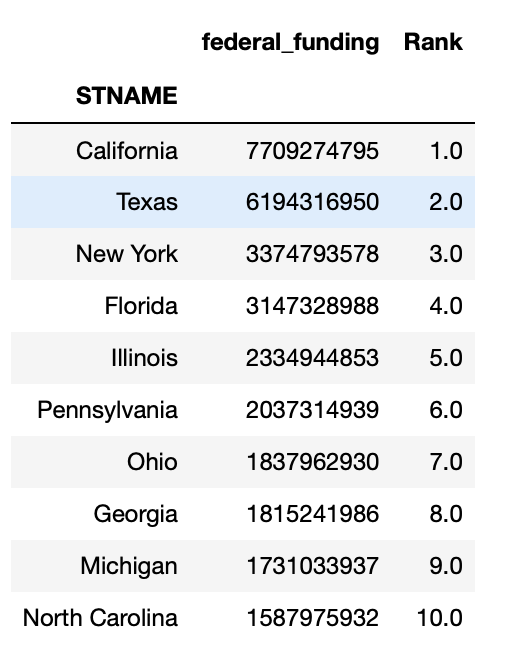 | 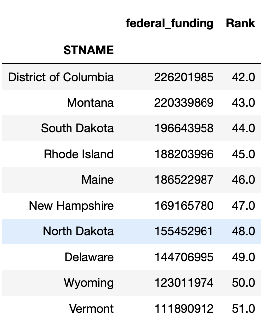
:-------------------------:|:-------------------------:
Figure 1: 10 States with high Federal Funding by States | Figure 2: 10 States with low Federal Funding

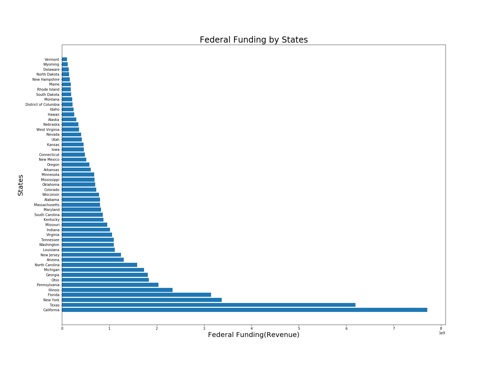
###### Figure 3: Federal Funding by States

### Rank and visualize Federal Funding per Student by States
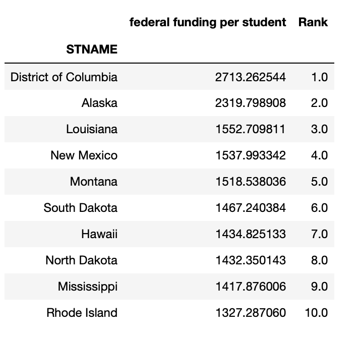 | 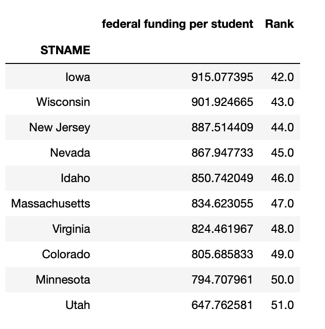 
:-------------------------:|:-------------------------:
Figure 4: 10 States with High Federal Funding per Student | Figure 5: 10 States with Low Federal Funding per Student

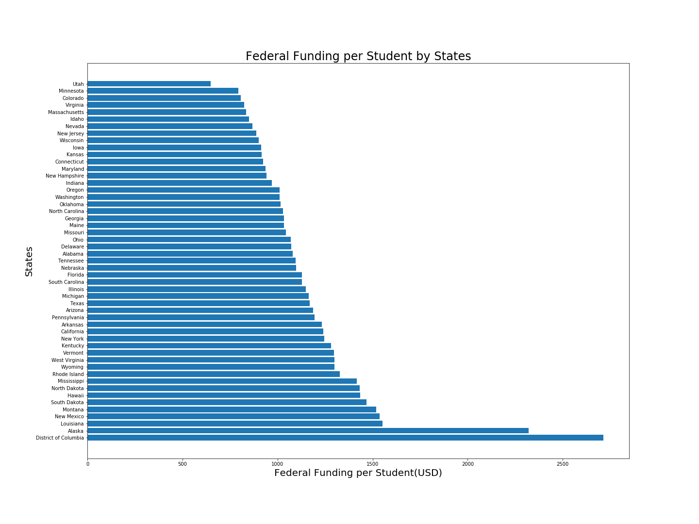
###### Figure 6: Federal Funding per Student by States

## Solution 2

### Relationship between Revenue and Expenditure

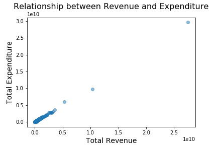
###### Figure 7:Scatter Plot between Revenue and Expenditure

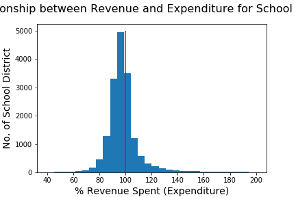
###### Figure 8: Percentage of Revenue used as Expenditure for each School District

Scatter Plot between Revenue and expenditure shows a positive correlation between the two: with the increase in revenue, expenditure also increases. Since, expenditure is a component of revenue, the distribution of percentage of revenue used as expenditure for all school districts has been visualized and normal distribution of data is obtained. 
It is observed that, around 5000 school districts spends almost all the fundung allocated to them. Additionally, the expenditure of a large proportion of school districts is less than their revenue. It has been also observed that there's school districts which spend more than the funding they received.

### Rank and visualize Debt per Student by States

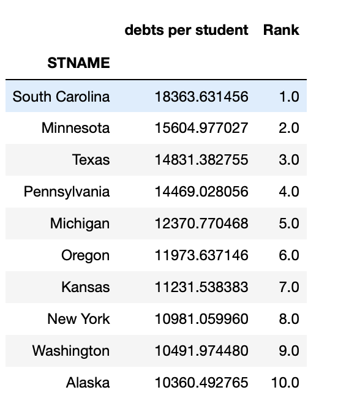 | 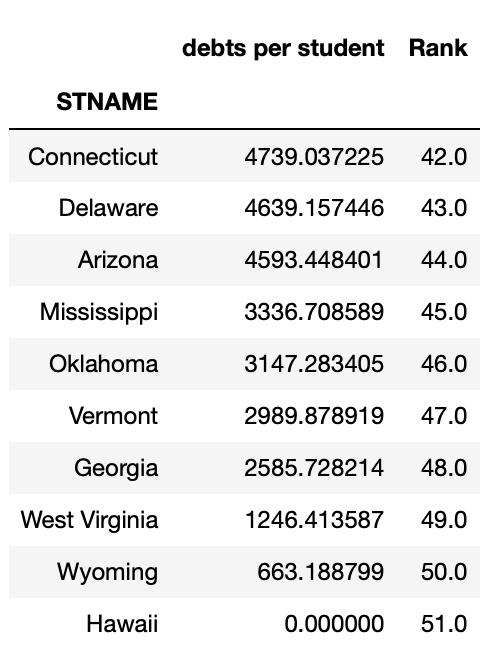
:-------------------------:|:-------------------------:
Figure 9: 10 States with High Student Debts | Figure 10: 10 States with Low Student Debts

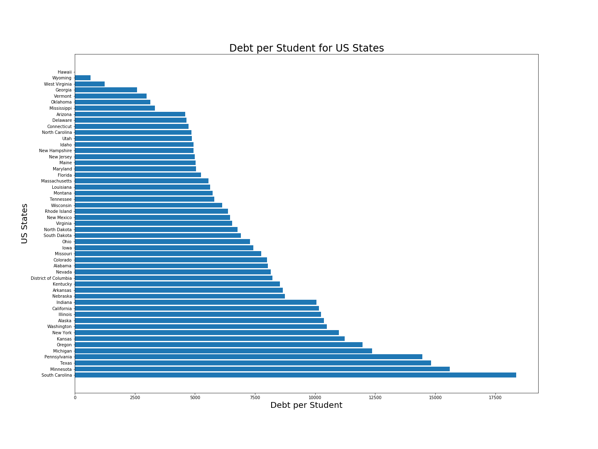
###### Figure 11: Debt per Student for US States

## Solution 3

To convert the blurred data of a column, all the unique values in that column were processed one by one and all the occurences of those raw values were replced by the new values in the column. The values containg all digits, were simply replaced by converting their type to be float. To process the ranges, mean of the range was calculated and replaced by the new value obtained. To process the greater than values containg GT, mean of the number attached with GT and the max value amongst all the values containing all digits was calculated and replaced by the new value obtained. To process the less than values containg LT, mean of the number attached with LT and the min value amongst all the values containing all digits was calculated and replaced by the new value obtained. The values containg greater than equal to values containg GE and less than equal to values containg LE were replaced by the number attached with LE/ GE. To replace all other values, the mean of the min and max values amongst all the values containing all digits was calculated.

The metric chosen was 'ALL_MTH00PCTPROF_1516' -  % of Students in the school that scored at or above proficient in Math, from the acheivement data in mathematics provided.

The min and max values amongst all the values containing all digits in this metric column were 2 and 98, hence the mean obtained was 50. The NaN values, 'PS' values were replaced by 50. Value like '45-49' was replaced by 47 (mean of 45 and 49), 'GE90' was replaced by 90, 'LT50' was replaced by 26 (mean of 2 and 50) and so on.

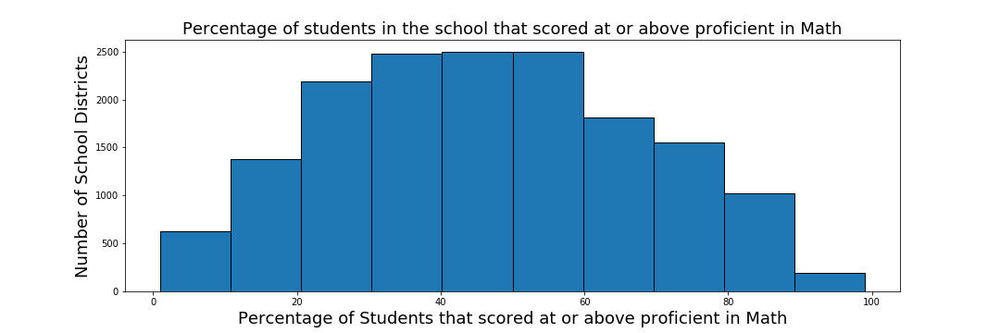
###### Figure 12: Histogram showing percentage of Students in the school that scored at or above proficient in Math corresponding to number of school districts

Figure 12 shows Number of school districts categorised by the percentage of students that scored at or above proficient in Math. It shows that about 80% to 90% students were good at math in about ~1000 schools and 50% to 60% students were good in math in about ~2500 schools. In around same number of school (2500) about 40% to 50% students were good at math.

## Solution 4

Cutting 15% of the US Federal budget currently being spent on funding school districts amounts to $8340410870.7. To choose the school districts which will have their funding cut following methodology was used:
For each school district, total expenditure and short term debt amount was subtracted from the total funding received by it and was then sorted in decreasing order of amount thus left. The school districts for which the amount left was in negatives were filtered out. For each of the school district then left, 40%, 20% or 0% of the amount left, whichever was higher than the initial federal revenue being received was decided to be the amount that should be deducted. This was done until the target amount was reached.

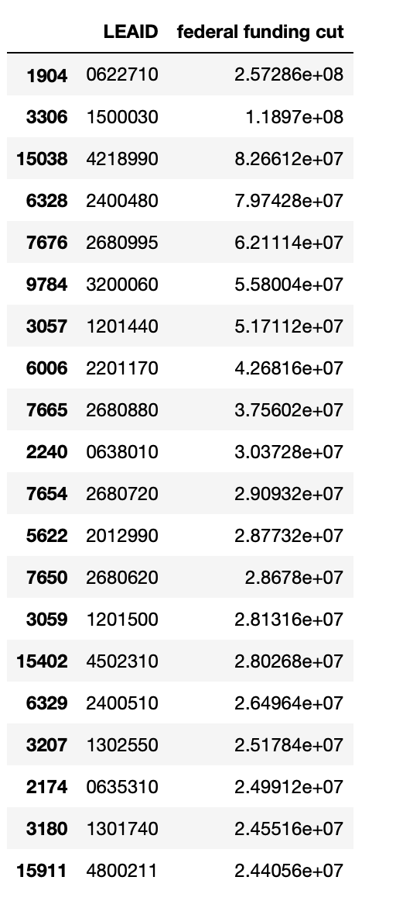

###### Figure 13: Top 20 School Districts for Federal Funding Cut

## Solution 5

For deducting the federal funds the approach has been selected in a way that the funding is reduced only from the extra amount schools were getting, such that there is still required amount of funds even after performing the cut.
The methodology mentioned above is justified by the fact that it takes into account the total expenditure and the short term debt for each school district. So that even after the decided amount is deducted from the federal revenue of the chosen school districts, they're left with enough funds.

